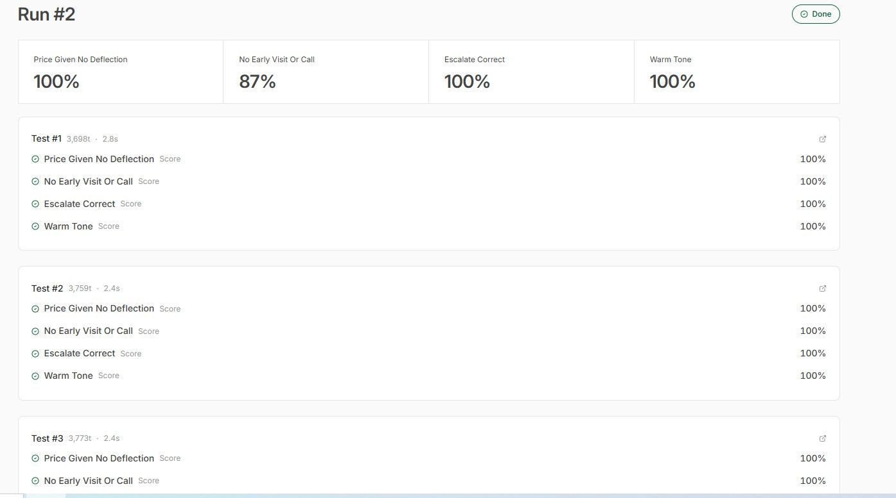

# Aligning a Production WhatsApp Sales Agent

An evaluation harness for "Mira", a customer-facing WhatsApp sales agent I built and run for a
landscaping company in Dubai, UAE. The agent handles real customer chats end to end (pricing,
product questions, bookings) on n8n, with WhatsApp and Chatwoot. This repo documents how I keep it
aligned in production: a rubric, a golden dataset from real conversations, and a scored evaluation
loop that runs before any change reaches a customer.

> Subject model: Google Gemini 3.5 Flash.
> Eval framework: n8n native Evaluation nodes, dataset stored as an n8n Data Table.

## Run 2 results

]

| Metric | Score |
| --- | --- |
| Price Given, No Deflection | 100% |
| No Early Visit or Call | 87% |
| Escalate Correct | 100% |
| Warm Tone | 100% |

Per case: roughly 3,700 tokens and 2.5 seconds.

## Why this exists
This is a production system, not a demo. Every reply lands on a real customer and on the company's
standing, so "looks good" is not the bar. The behaviors that move money in this business are
specific: quote a real price instead of deflecting, do not spend field resources on a site visit
offered too early (in the UAE a visit is a cost, not a default, and roughly 8 in 10 never
converted), escalate genuine complaints and payments to a human, and stay warm. I measure those
behaviors continuously instead of assuming them.

## Method
1. **Rubric.** Translate the business-critical behaviors into four measurable checks.
2. **Golden dataset.** 15 cases built from real customer messages, including hard ones ("just give
   me one fixed price", "how much" with no size, an angry no-show complaint). It grows as real chats
   surprise the system. See [`eval/dataset.csv`](eval/dataset.csv).
3. **Harness.** Run every case through the live brain (knowledge base plus agent) and score each
   with deterministic metrics. The harness stops before the WhatsApp and Chatwoot send steps, so
   evaluation never messages a real customer.
4. **Gate.** Read the scores after every prompt or model change; ship only what does not regress.

## Metrics
Full definitions and the exact scoring expressions are in [`eval/metrics.md`](eval/metrics.md).
`No Early Visit or Call` at 87% is the behavior currently being tuned; the loop is how that number
is tracked as it moves.

## What the loop has driven
- Grounding the agent strictly in the company knowledge base moved Price Given to 100% and removed
  invented figures.
- A digital-first strategy plus real tools (not a single generic action) is what the No Early Visit
  metric now protects.

## Limitations and next
- Metrics are rule-based: fast and deterministic, but they do not judge nuance. Next layer is an
  LLM-as-judge metric for warmth and correctness.
- The harness uses a condensed prompt; production parity means carrying the exact system message.
- 15 cases is a starting set. Coverage grows over time.
- Planned: gate releases on metric thresholds so a regression blocks a deploy.

## Stack
n8n, WhatsApp Business API, Chatwoot, Google Gemini 3.5 Flash, n8n Evaluation nodes and Data Tables.

## Full write-up
[`docs/eval-report.md`](docs/eval-report.md).

---
Built and maintained by Zaffar.
